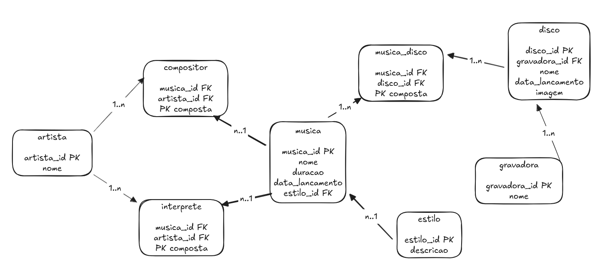

# 🎵 Empire Records - Sistema de Gestão Musical Desktop


Aplicação Desktop robusta desenvolvida como projeto prático para o curso de **Análise e Desenvolvimento de Sistemas**. O sistema integra utilitários lógicos de aprendizado e um ecossistema completo para gerenciamento de acervos musicais com persistência em banco de dados.

---

## 📋 Sobre o Projeto

Este software foi desenvolvido no **Senac HUB ACADEMY (Campo Grande, MS)** sob a orientação do **Professor Thiago Lodi**. O projeto documenta a evolução acadêmica no desenvolvimento desktop, cobrindo desde a manipulação básica do DOM até arquiteturas complexas multi-camadas.

### 🏫 Instituição e Equipe
* **Curso:** Análise e Desenvolvimento de Sistemas
* **Turma:** 64.2025
* **Orientador:** Prof. Thiago Lodi
* **Desenvolvedora:** Juliana Gabinio

---

## ✨ Funcionalidades do Ecossistema

O projeto é dividido em módulos que representam diferentes níveis de complexidade técnica:

### 🎼 Gestão Musical (Módulo Principal)
Sistema CRUD completo com relacionamentos relacionais:
* **Artistas:** Gestão dinâmica com classificação entre Intérprete, Compositor ou Ambos.
* **Discos:** Controle de álbuns, incluindo capas personalizadas (URL) e gerenciamento de tracklist.
* **Músicas:** Cadastro detalhado com suporte a múltiplas participações (N:M).
* **Associação de Papéis:** Interface dedicada para definir as funções de cada artista no catálogo.
* **Busca Global:** Sistema de pesquisa inteligente que varre todas as entidades do banco simultaneamente.

### 🛠️ Módulos de Aprendizado
| Módulo | Descrição Técnica |
| :--- | :--- |
| **ℹ️ Versões** | Exposição dos metadados das tecnologias base (Chromium, Node e Electron). |
| **🔢 Contador** | Gestão de estado global no Processo Principal com feedback visual e animações CSS3. |
| **🧮 Calculadora** | Lógica aritmética processada via IPC, suporte a eventos de teclado e histórico de operações. |

---

## 🚀 Diferenciais Técnicos (ADS)

* **Arquitetura Multi-camadas:** Separação rígida entre Camada de Visão (`view`), Camada de Serviço/Lógica (`service`) e Camada de Dados (`database`).
* **Segurança IPC:** Isolamento total do sistema operacional através de `contextBridge` no arquivo `preload.js`.
* **Otimização de Performance:** Consultas SQL utilizando `GROUP_CONCAT` e Subqueries para mitigar o problema de performance **N+1**.
* **Integridade Referencial:** Implementação de travas de segurança que impedem a deleção de registros com dependências ativas (Ex: Estilos vinculados a músicas).

---

## 🗄️ Estrutura do Banco de Dados

O sistema utiliza o motor **SQLite3** pela sua eficiência em aplicações locais.

### 📊 Diagrama Entidade-Relacionamento (DER)


### Tabelas Principais
| Tabela | Função |
| :--- | :--- |
| `artista` | Cadastro base de músicos e autores. |
| `disco` | Registro de álbuns, anos de lançamento e gravadoras. |
| `musica` | Registro de faixas com metadados de estilo e duração. |
| `musica_disco` | Relaciona músicas aos discos definindo a ordem das faixas (Ordem/Tracklist). |
| `interprete` / `compositor` | Tabelas pivot para suporte a múltiplos créditos por faixa (Relacionamento N:M). |

---

## 🛠️ Tecnologias Utilizadas

* **Runtime:** Node.js v20.x
* **Framework:** Electron v40.0.0
* **Banco de Dados:** SQLite3
* **Interface:** HTML5, CSS3, JavaScript (ES6 Modules)
* **Design:** Bootstrap 5.3 & Bootstrap Icons

---

## 💻 Como Rodar o Projeto

1. **Clonar e Instalar Dependências:**
   ```bash
   git clone [https://github.com/seu-usuario/empire-records.git](https://github.com/seu-usuario/empire-records.git)
   cd empire-records
   npm install

2. **Executar em Modo de Desenvolvimento:**
    ```bash
    npm start

---

## 🎓 Autoria

Desenvolvido por **Juliana Gabinio** como parte dos requisitos de avaliação do curso de ADS - Senac HUB Academy.

© 2026 Juliana Gabinio - Todos os direitos reservados.

